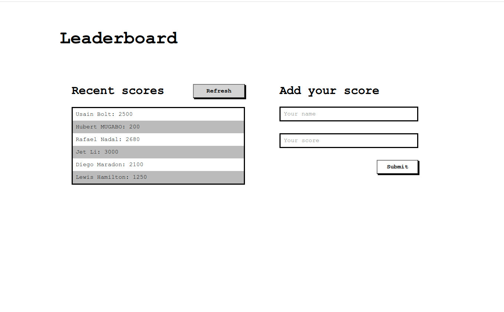

# Leaderboard

This app uses an API to store scores submitted by players and displays a list of the most recent scores.

## Screenshot



## Built With

- HTML
- CSS
- Javascript
- Webpack


## Getting Started

To get a local copy up and running follow these simple steps inside the root folder.

### Setup

Install dependencies with:

```
npm install 
```

### Usage

Start server with:

```
npm start
```

it will open `http://localhost:8080/` in your default browser.

## Authors

👤 **Hubert MUGABO**

- Github: [@mugberto](https://github.com/mugberto)
- Twitter: [@mugberto](https://twitter.com/mugberto)
- Linkedin: [mugberto](https://www.linkedin.com/in/hubert-mugabo-23144b6a/)

## 🤝 Contributing

Contributions, issues and feature requests are welcome!

Feel free to check the [issues page](https://github.com/mugberto/leaderboad/issues).

## Show your support

Give a ⭐️ if you like this project!

## Acknowledgments

- Microverse

## 📝 License

This project is MIT Lisenced